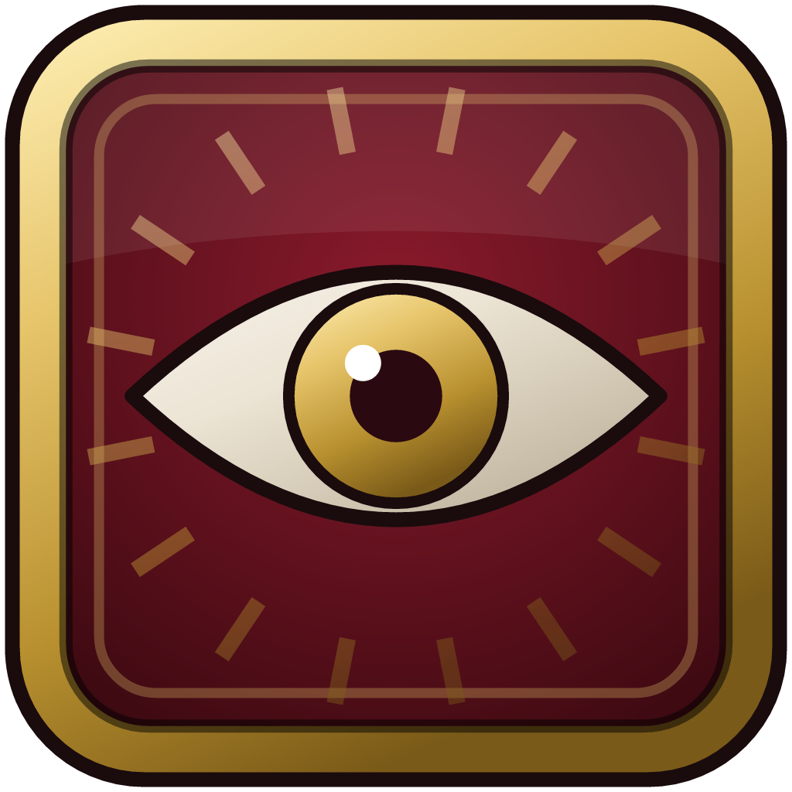

<p align="center">
  
</p>

<h1 align="center">Vigil</h1>

<p align="center">
  The <a href="https://guildbook.io">Guildbook</a> desktop companion for WoW: Forever. It watches your combat log, coaches each fight live on a second screen and uploads your fights to your guild's Guildbook site.
</p>

<p align="center">
  <a href="https://github.com/Guildbook/vigil/actions/workflows/ci.yml"></a>
  <a href="https://github.com/Guildbook/vigil/releases/latest"></a>
  <a href="https://github.com/Guildbook/vigil/releases"></a>
  <a href="LICENSE"></a>
  <a href="https://guildbook.io/vigil"></a>
  <a href="https://guildbook.io"></a>
  <a href="https://x.com/GuildbookIO"></a>
</p>

Vigil only reads the combat log file on disk. It never sends input to the game, reads its memory or looks at the screen.

## Download

Get the latest version from [guildbook.io/vigil](https://guildbook.io/vigil) or from [GitHub Releases](https://github.com/Guildbook/vigil/releases/latest). Pick the file for your system:

| Platform | File |
|---|---|
| macOS (Apple Silicon and Intel) | `Vigil-x.y.z-mac-universal.dmg` |
| Windows 10/11 (x64) | `Vigil-x.y.z-win-x64.exe` |
| Linux (x64) | `Vigil-x.y.z-linux-x86_64.AppImage` |

The `mac-universal.zip` on the release page is the macOS update feed; most people want the dmg.

## Getting started

1. **Install Vigil.** On macOS, open the dmg and drag Vigil to Applications. On Windows, run the installer. On Linux, `chmod +x Vigil-*.AppImage` and run it.
2. **Turn on combat logging in WoW.** Enable **Advanced Combat Logging** once, in System > Network. Then type `/combatlog` in chat each session to start logging. (The Vigil addon, which the app can install for you, turns logging on at every login with `/vigil log on`.)
3. **Pair Vigil with your guild.** On your guild's Guildbook site, open **Vigil**, then **Connect Vigil companion**, and create a pairing code. Enter it in Vigil's settings, or click **Open in the companion** to pair in one step.

## First launch on unsigned builds

Current builds are not code signed yet, so your operating system warns the first time you open Vigil:

- **macOS:** right-click (or Control-click) Vigil in Applications and choose **Open**, then **Open** again. If macOS still refuses, go to System Settings > Privacy & Security and click **Open Anyway**.
- **Windows:** SmartScreen shows "Windows protected your PC". Click **More info**, then **Run anyway**.
- **Linux:** no warning; just make the AppImage executable.

## Features

- **Finds your logs automatically.** Vigil looks in the usual World of Warcraft install folders (Applications on macOS; Program Files, Games and drive roots on C:, D: and E: on Windows; a Wine prefix under `~/Games/world-of-warcraft` on Linux) and checks every client folder there: WoW: Forever, Classic beta and PTR, Classic Era, Anniversary and Classic progression. It follows the client with the most recent combat log, and keeps looking every 15 seconds until one appears. You can point it at a different folder in settings.
- **Live fight view.** Vigil tails `WoWCombatLog*.txt` as the game writes it and shows the current fight as it happens: score, damage, threat or healing per second, GCD use, idle time, buff and debuff uptimes and rotation callouts. The rotation model is picked from the spells you cast, or you can choose one.
- **Encounter parsing.** Boss and trash fights are split out and scored when they end, with a per-fight summary in the window. **Details** on a finished fight shows your abilities, damage taken by each enemy ability and who it hit, the group meter and deaths.
- **Group meter and deaths.** Damage and healing for everyone in your party or raid, with class icons worked out from the spells each player casts, and each death with its killing blow.
- **Boss intel.** Every Classic Era dungeon boss from Ragefire Chasm to Stratholme, plus Molten Core and Onyxia's Lair, is written up ability by ability: what each one does and what to do about it, with Blizzard's spell icons and boss portraits. Dungeon entries are shorter than raid ones, and bosses with only one or two abilities worth knowing are marked partial. During and after a boss fight, Vigil adds what it saw in your log (damage per ability, who got hit, how often the boss cast abilities that hit nobody, deaths, kill or wipe). Classic Era only logs `ENCOUNTER_START` in raids, so dungeon bosses are recognised by NPC ID or name instead. **Intel** browses dungeons (with level ranges) and raids, and searches bosses, instances and abilities; Blackwing Lair, Zul'Gurub, both Ahn'Qiraj raids and Naxxramas are recognised but not written up yet. Entries marked unconfirmed have not been checked against Classic Era data.
- **Automatic uploads.** Each finished fight is uploaded to your guild's Guildbook site. Uploads run one at a time and retry with backoff if the site is busy or unreachable; a failed upload can be retried by hand. Trash fights shorter than a minimum length (20 seconds by default) are skipped; boss kills and wipes, dungeon bosses included, always upload, and you can turn auto-upload off or choose who can see your uploads.
- **Second-screen friendly.** Full and compact layouts, and an option to keep the window on top.
- **Tray icon.** Vigil lives in the menu bar on macOS and the system tray on Windows and Linux. The menu shows what Vigil is doing (watching a client's log, waiting for one, uploading, paused, or what needs attention) and your paired guild, and lets you open the window, pause and resume uploads, open the Logs folder or your guild's site, check for updates and quit. On Windows and Linux a click shows or hides the window. Closing the window keeps Vigil running in the tray so fights keep uploading; you can turn that off in settings, and on macOS and Windows you can have Vigil start when you log in.
- **In-game addon.** Vigil can install its companion addon into any detected WoW client.
- **Updates.** Vigil checks for a new version shortly after launch and every six hours. Windows and Linux AppImage builds download updates quietly and offer a restart. Unsigned macOS builds can't update themselves (macOS only installs updates signed by the same Developer ID), so they tell you when a new version is out and link to the download page.

## Privacy

- **What Vigil reads:** the `WoWCombatLog*.txt` files in your WoW Logs folder, and the names of the client folders it scans to find them. Nothing else on your computer.
- **What Vigil sends:** when you pair, the pairing code and a device name (`Vigil on <your computer's name>`). After that, a report for each finished fight: the encounter, your character's name and level, and your fight statistics (totals, spells, uptimes, rotation and score). The raw combat log is never uploaded.
- **Where it sends it:** only to Guildbook (guildbook.io) and your guild's own site. The address is fixed when the app is built. Vigil also checks GitHub Releases for updates, and downloads spell icons and boss portraits from Blizzard's image server (render.worldofwarcraft.com); those requests carry only the image's file name.
- **Stored on your computer:** your settings and pairing, with the device token kept in the system keychain (Keychain on macOS, DPAPI on Windows). Unpairing deletes the token. Downloaded icons and portraits are cached in the settings folder (`media-cache`) for up to 30 days.

See the [Guildbook Privacy Policy](https://guildbook.io/privacy) for how your guild's site handles uploaded fights.

## FAQ and troubleshooting

**Vigil says no Logs folder was found.** WoW creates the `Logs` folder the first time it writes a combat log, so enable Advanced Combat Logging, type `/combatlog` in game and fight something. If WoW is installed somewhere unusual, choose the folder in Vigil's settings (the WoW folder, the client folder such as `_classic_era_`, or the `Logs` folder itself all work).

**Pairing doesn't work.** Create a fresh code on your guild's Vigil page and enter it exactly. Check that you can reach [guildbook.io](https://guildbook.io) from this computer. If Vigil says the site refused the companion, the device was probably removed on the site; unpair and pair again.

**Fights show but don't upload.** Check that Vigil is paired and auto-upload is on. Short trash fights are skipped on purpose; the fight list shows the reason for each skipped upload.

**I closed the window but Vigil is still running.** That's on purpose: it keeps following the log and uploading from the tray (the menu bar on macOS). Quit from the tray menu, the app menu or Cmd+Q, or turn off **Keep running in the tray when closed** in settings. **Start Vigil when I log in** is in the same place on macOS and Windows; on Linux, add the AppImage to your desktop's startup applications instead (an AppImage moves when it updates, so Vigil doesn't register itself). Some Linux desktops (GNOME without an AppIndicator extension) show no tray at all; launch Vigil again to bring its window back.

**Which WoW versions work?** Vigil is built for WoW: Forever. Classic Era and Anniversary logs use the same format and work well for trying Vigil out. Retail is not a target.

**Is this allowed?** Vigil only reads a log file that the game writes for this purpose. It doesn't touch the game client.

## Development

Requires Node 22 and pnpm 10 (`corepack enable`).

```bash
pnpm install
pnpm dev           # build, watch and launch (pairs through http://localhost:3000, a local Guildbook site)
pnpm typecheck
pnpm lint
pnpm test          # tailer, engine, group, boss data, icon map, media cache, paths, uploader, trusted-origin, tray and house-style tests
```

Without the game, try it with a synthetic log written in real time:

```bash
pnpm demo:log /tmp/vigil-demo/Logs                  # terminal 1
VIGIL_LOGS_DIR=/tmp/vigil-demo/Logs pnpm dev         # terminal 2
```

`DEMO_SCENARIO=raid pnpm demo:log ...` writes a 40-player Ragnaros kill instead of the solo warrior, which exercises the group meter, deaths and boss intel. `DEMO_SCENARIO=stockade` (or `dungeon`) writes a five-player Stockade run: prisoner trash, Targorr the Dread, Kam Deepfury, a wipe and then a kill on Hamhock, and Bazil Thredd. It has no encounter events, as Classic Era logs dungeons, so it exercises boss recognition by unit, kill and wipe detection and the always-upload rule. `DEMO_SCENARIO=deadmines` does the same with Rhahk'Zor, Mr. Smite and Edwin VanCleef.

Development-only variables: `VIGIL_SITE_URL` (the site to pair with, default `http://localhost:3000`), `VIGIL_LOGS_DIR` (Logs folder), `VIGIL_USER_DATA` (settings folder), `VIGIL_PAIR_CODE` (pair on launch), `VIGIL_CAPTURE_DIR` (save window PNGs every `VIGIL_CAPTURE_EVERY_MS`). Packaged builds ignore them.

On macOS, `pnpm dev` runs a copy of Electron.app renamed to Vigil (bundle id `io.guildbook.vigil.dev`, the Vigil icon), made by `scripts/dev-app.mjs` in `node_modules/.cache/vigil-dev/` as an APFS clone and rebuilt when Electron or the icon changes. macOS names notifications, the menu bar and the Dock after the running bundle, so the stock Electron.app would show "Electron" and its logo there. The first notification asks for permission for "Vigil" once. `VIGIL_STOCK_ELECTRON=1 pnpm dev` runs the stock bundle, and `pnpm start` always does.

The app is named Vigil (`src/core/identity.ts`, with `productName` in `package.json` and `electron-builder.config.cjs`, kept in step by `test/identity.test.ts`), but settings stay in the `vigil` folder and the device token's safeStorage key stays "vigil Safe Storage", the names 0.1.0 used, so updating never loses a pairing.

### Layout

```text
src/core/        log tailer, live engine, group observer, boss lookup, media cache, uploader, WoW paths, addon install, trusted origins
src/data/        boss intel (bosses.ts for raids, dungeons/ one file per dungeon) and the generated spell icon map (spell-icons.json, boss-spells.json)
src/main/        Electron main process, preload, settings store, auto-update
src/renderer/    the window (HTML, CSS, TypeScript); icons/ holds bundled Blizzard class and faction icons
shared/lib/      combat log parser and Vigil analysis, vendored from the Guildbook site
resources/addon/ the Vigil in-game addon, installed by the app
resources/tray/  tray icons, drawn by `pnpm tray:icons` (scripts/tray-icons.ts)
scripts/         build, dev, demo log, tray icons and the icon map generator
build/           icons and macOS entitlements
test/            Vitest tests; test/support/ builds synthetic combat logs
```

### Shared code

`shared/lib/` is a copy of the Guildbook site's `src/lib/combatlog/`, `src/lib/vigil/` (analysis, live session, rotations, report schema) and `src/lib/game.ts`. Imports use `@/lib/...`, which esbuild, Vitest and `tsc` resolve to `shared/`, so files can be copied between the repositories unchanged. The report schema (`shared/lib/vigil/report.ts`) is the upload contract with the site's `/api/vigil/companion/reports`, so change both together.

### Icon data

`src/data/spell-icons.json` maps Classic Era spell IDs (and class spell names) to icon file names, and records which class each class spell belongs to (used to show a class icon for other players). `src/data/boss-spells.json` holds the client's name for every spell ID in the boss intel, so tests can check each ability points at the right spell. Both are generated from the Classic Era client's DB2 tables (SpellMisc, ManifestInterfaceData, SpellName, SpellClassOptions), downloaded as CSV from wago.tools:

```bash
pnpm icons:generate                         # default client build (scripts/icon-data.ts)
pnpm icons:generate --build 1.15.9.69722    # a specific build
pnpm icons:generate --verify-cdn            # also check every icon exists on render.worldofwarcraft.com
```

If `BATTLENET_CLIENT_ID` and `BATTLENET_CLIENT_SECRET` are set, the script also compares the boss spells' icons with Blizzard's Game Data API spell media (a retail namespace, so differences are reported rather than applied). Those credentials are only for the script; the app never uses Battle.net credentials. Icons the CDN doesn't have are listed under `missing` in the JSON and get the placeholder.

### Trusted servers

Every API call goes to one home server, baked in at build time (`VIGIL_HOME_URL`, default `https://guildbook.io`; `scripts/build.mjs` refuses anything but a public https origin). Pairing codes are global, so the home server knows which guild a code belongs to and answers with that guild's site (its subdomain, or a verified custom domain). Links open only for the home domain and its subdomains, the paired guild's own site and `github.com/Guildbook/` (`src/core/origins.ts`, tested). Development runs are the only builds that accept local hosts. The window's CSP allows only its own files and no network access; the main process does all networking. Images are the one exception, and they still don't leave the main process: the window loads `vigil-media://` URLs (`img-src 'self' data: vigil-media:`), and the main process answers them from a disk cache, fetching from `https://render.worldofwarcraft.com` only (no redirects, images only, at most 2 MB, cached 30 days; `src/core/media.ts`, tested). Unknown or unreachable art gets a neutral placeholder. The device token is stored with Electron `safeStorage` (Keychain on macOS, DPAPI on Windows).

### Packaging

`electron-builder.config.cjs` builds a universal macOS dmg and zip, a Windows NSIS installer (x64) and a Linux AppImage (x64), with app id `io.guildbook.vigil`. Output goes to `release/` (gitignored).

```bash
pnpm dist          # the current OS, unsigned unless signing variables are set
pnpm dist:mac      # universal dmg + zip (ad-hoc signed without a Developer ID)
pnpm dist:dir      # unpacked app only, for a quick look
```

The macOS icon (`build/icon.icns`) and the dmg window's background (`build/background.png`, `background@2x.png`) are committed; after changing `build/icon-mac.png` or the dmg layout, regenerate them on a Mac with `pnpm mac:assets`.

Signing and notarization switch on when their variables are set and are skipped otherwise (`scripts/signing.cjs`). Signed macOS builds use the hardened runtime with `build/entitlements.mac.plist`.

**Auto-update.** `electron-updater` checks this repository's latest GitHub Release 15 seconds after launch and every six hours.

## Releasing

1. Bump `version` in `package.json` (for example to `0.2.0`) and commit.
2. Tag and push: `git tag -a v0.2.0 -m "What changed, in Markdown"` then `git push origin v0.2.0`. The tag message becomes the release notes; the tag must match the package version.
3. `.github/workflows/release.yml` creates a draft release, builds on macOS, Windows and Linux, uploads the installers and `latest*.yml` (the update feeds), and adds a marker to the notes saying which builds are signed.
4. Check the draft, edit the notes if you like (keep the `vigil-signing` comment, which the download page reads), and publish it as the latest release. [guildbook.io/vigil](https://guildbook.io/vigil) picks it up within the hour, and installed apps on their next check.

`.github/workflows/ci.yml` typechecks, lints, tests and bundles on pushes to `main` and pull requests.

### Signing secrets

Repository secrets (Settings, Secrets and variables, Actions). All optional; without them the builds are unsigned.

| Platform | Secrets |
|---|---|
| macOS signing | `MAC_CSC_LINK` (base64 of the Developer ID Application `.p12`), `MAC_CSC_KEY_PASSWORD` |
| macOS notarization (API key, preferred) | `APPLE_API_KEY_P8` (contents of the `.p8`), `APPLE_API_KEY_ID`, `APPLE_API_ISSUER` |
| macOS notarization (Apple ID) | `APPLE_ID`, `APPLE_APP_SPECIFIC_PASSWORD`, `APPLE_TEAM_ID` |
| Windows, Azure Trusted Signing | `AZURE_TENANT_ID`, `AZURE_CLIENT_ID`, `AZURE_CLIENT_SECRET`, `AZURE_TRUSTED_SIGNING_ENDPOINT`, `AZURE_TRUSTED_SIGNING_ACCOUNT`, `AZURE_TRUSTED_SIGNING_PROFILE`, `AZURE_TRUSTED_SIGNING_PUBLISHER` |
| Windows, certificate | `WIN_CSC_LINK` (base64 of the `.pfx`), `WIN_CSC_KEY_PASSWORD` |

A Mac build only counts as signed when it is also notarized; otherwise Gatekeeper still stops it on first launch.

## Contributing

Bug reports and pull requests are welcome on [GitHub Issues](https://github.com/Guildbook/vigil/issues). Before opening a pull request, run `pnpm typecheck`, `pnpm lint` and `pnpm test`. Changes to the upload report schema need a matching change on the [Guildbook site](https://github.com/Guildbook/guildbook).

## License

Vigil is licensed under the [GNU Affero General Public License v3.0](LICENSE). The license does not cover Blizzard artwork (see below) or the bundled Cinzel and Inter fonts, which are under the SIL Open Font License.

### Blizzard assets

Class icons, spell icons and any other Blizzard artwork included in the app are the property of Blizzard Entertainment, Inc. and are not covered by the AGPL. They are used for identification only.

- `src/renderer/icons/classes/` and `src/renderer/icons/factions/` are copies of Blizzard's own class and faction icons from render.worldofwarcraft.com, bundled so they show without a network connection (see `src/renderer/icons/NOTICE`). `fallback.svg` there is Vigil's own and is AGPL.
- Spell icons and boss portraits are not bundled; the app downloads them from render.worldofwarcraft.com and caches them for at most 30 days, in line with Blizzard's API terms.
- The spell-to-icon map and spell names in `src/data/` are derived from Blizzard's game client data. Encounter IDs and dungeon level ranges come from the client's DungeonEncounter and LFGDungeons tables; NPC and creature display IDs were cross-checked against the open-source CMaNGOS Classic database. The ability descriptions and advice in `src/data/bosses.ts` and `src/data/dungeons/` are Vigil's own writing.
- No art or text comes from Wowhead or other fan sites.

## Disclaimer

World of Warcraft and Blizzard Entertainment are trademarks or registered trademarks of Blizzard Entertainment, Inc. Vigil is a fan project, not affiliated with or endorsed by Blizzard. It uses no Blizzard logos.
